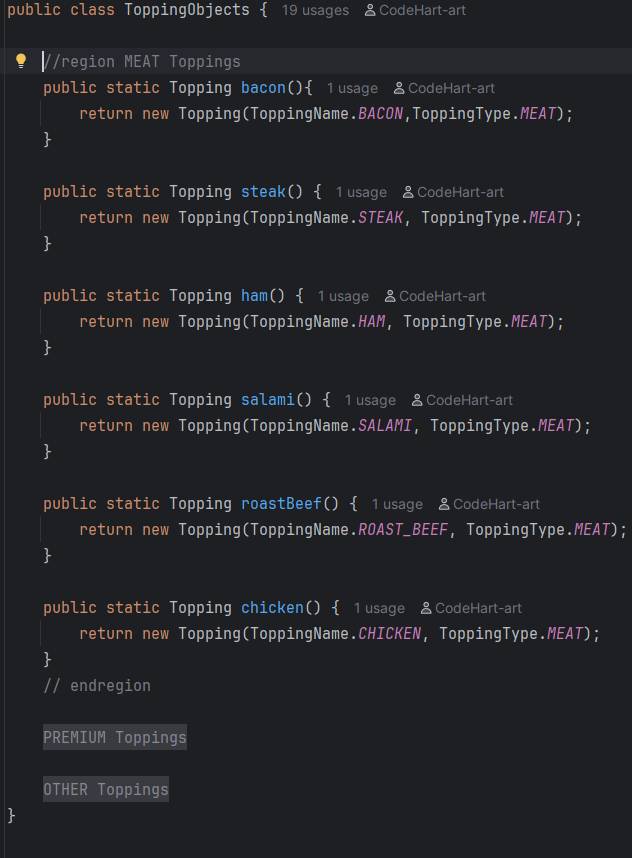
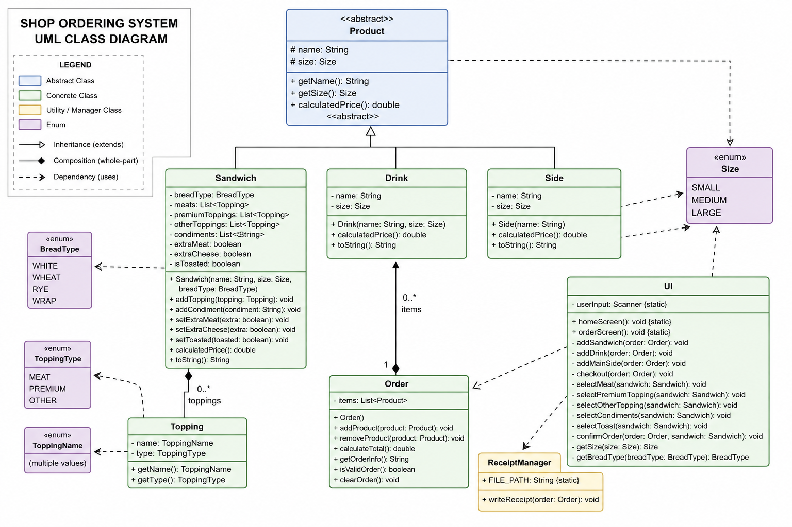

# 🥪 The Shop

---

## 📌 Quick Description

This is a Java-based console system for a sandwich shop.  
It allows users to build custom orders, add multiple product types, and generate a receipt upon checkout.

The system is built using object-oriented programming principles including:
- Encapsulation
- Inheritance
- Polymorphism
- Modular class design

---

## 🚧 Project Journey

This project was challenging because of the number of moving parts in the WHOLE system.  
The hardest part was structuring the sandwich builder and making sure all toppings, meats, sauces, and options worked correctly without breaking the flow of the menu system.

At first, managing multiple menus felt repetitive and overwhelming, but over time I learned how to:
- Break logic into smaller methods
- Use loops for validation instead of repeated code
- Pass the `Order` object through the system correctly
- Improve readability by restructuring the UI

---
## 🧩 Class Overview

### UI
Handles all user input and menus.

### Order
Stores all products and calculates totals.

### Product (Abstract)
Base class for all items in the shop.

### Sandwich / Drink / Side
Concrete products with custom pricing logic.

### Topping
Represents sandwich ingredients grouped by type.

### ReceiptManager
Writes order receipts to file system.

---
## 🧠 Code I’m Proud Of

This was one my solutions to many problems as I was finding it difficult to incorporate toppings without adding them directly to UI class.

---

## Final UML

